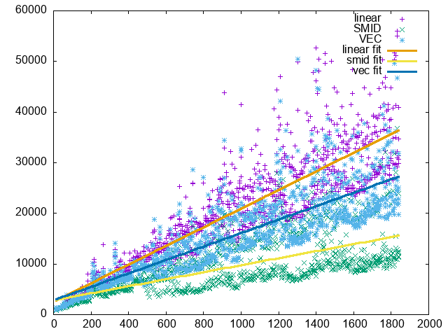

# «Параллельные вычислительные и программные модели для многопроцессорных вычислительных систем»

## Лабораторная работа №1

### Вариант 14

В целочисленной последовательности заменить все элементы, значение которых больше заданного на это предельное значение и вычислить сумму отброшенных значений.

**Цель работы**: изучение технологий использования векторных расширений наборов
инструкций современных микропроцессоров в компиляторах языка Си.

В ходе работы требуется реализовать функцию с использованием
следующих технологий:
1. Без распараллеливания с использованием стандартных средств последовательного
программирования в качестве сравнительного эталона быстродействия и выдаваемого
результата.
1. С использованием векторных инструкций микропроцессора, кодируемых intrinsic-
функциями.
1. С использованием векторных расширений языка Си компилятора gcc.
См. [Using vector instructions through built-in functions](https://gcc.gnu.org/onlinedocs/gcc/extensions-to-the-c-language-family/using-vector-instructions-through-built-in-functions.html).


Освоить способ измерения времени выполнения участка кода с использованием команды
(внутренней функции) __rdtsc(). Измерить время выполнения всех запрограммированных
вариантов.

#### Стандартные средства.
```c
// regular.h

#ifndef REGULAR_H_INCLUDED
#define REGULAR_H_INCLUDED
#include <stddef.h>
#include <stdbool.h>

int sum_and_exclude(int* array, size_t N, int treshold);
#endif
```

```c
// regular.c

#include "regular.h"

int sum_and_exclude(int* array, size_t N, int treshold){
    int sum = 0;
    int delta = 0;
    bool mask = false;
    int tmp = 0;

    int cond_delta = 0;
    for (size_t i = 0; i<N; i++) {
        tmp = array[i];
        delta = tmp - treshold;
        mask = delta > 0;
        cond_delta = delta * (int) (mask);
        sum += cond_delta;
        tmp -= cond_delta;
        array[i] = tmp;
    }
    return sum;
}
```

#### С использованием intrinsic.

```c
// smid.h

#ifndef SMID_H_INCLUDED
#define SMID_H_INCLUDED
#include <immintrin.h>
#include <x86intrin.h>
#include <stddef.h>
// #include <stdbool.h>
static int hsum(__m256i);
int sum_and_exclude_intrinsic(int* array, size_t N, int treshold);
#endif
```

```c
// smid.c

#include "smid.h"

static int hsum(__m256i x) {
    __m128i l = _mm256_extracti128_si256(x, 0);
    __m128i h = _mm256_extracti128_si256(x, 1);
    l = _mm_add_epi32(l, h);
    l = _mm_hadd_epi32(l, l);
    return _mm_extract_epi32(l, 0) + _mm_extract_epi32(l, 1);
}


int sum_and_exclude_intrinsic(int* const array, const size_t N, const int treshold){
    __m256i _delta, _cond_delta, _sum, _treshold, _zero, _mask, _block;

    _treshold = _mm256_set1_epi32(treshold);
    _zero = _mm256_set1_epi32(0);
    _sum = _mm256_setzero_si256();
    
    for (const int* p = array; p < array + N; p+=8) {
        _block = _mm256_load_si256((__m256i*)p); // read tmp = array[i-1]
        _delta = _mm256_sub_epi32(_block, _treshold); // int delta = array[i-1] - treshold;
        _mask = _mm256_cmpgt_epi32(_delta, _zero); // bool (delta > 0)
        _cond_delta = _mm256_and_si256(_delta, _mask); // int cond_delta = delta * (int) (delta > 0);
        _sum = _mm256_add_epi32(_sum, _cond_delta); // sum += cond_delta;
        _block = _mm256_sub_epi32(_block, _cond_delta); // array[i-1] -= cond_delta;
        _mm256_store_si256((__m256i*)p, _block); // write array[i-1] = tmp
    }

    return hsum(_sum);
}
```

#### С использованием векторных расширений gcc

```c
// gvec.h

#ifndef GVEC_H_INCLUDED
#define GVEC_H_INCLUDED
#include <immintrin.h>
#include <x86intrin.h>
#include <stddef.h>
#include <string.h>

typedef int v8si __attribute__ ((vector_size (32), aligned(32)));

static int hsum(__m256i);
int sum_and_exclude_vectors(int* const, const size_t, const int);

#endif
```

```c
// gvec.c

#include "gvec.h"

union v8 {
    v8si vec;
    int nums[8];
    __m256i mv;
};

static int hsum(__m256i x) {
    __m128i l = _mm256_extracti128_si256(x, 0);
    __m128i h = _mm256_extracti128_si256(x, 1);
    l = _mm_add_epi32(l, h);
    l = _mm_hadd_epi32(l, l);
    return _mm_extract_epi32(l, 0) + _mm_extract_epi32(l, 1);
}


int sum_and_exclude_vectors(int* const array, const size_t N, const int treshold){
    v8si _delta, _cond_delta, _mask;
    union v8 _block = {0};
    v8si _sum = {0};

    for(int* p = array; p < array + N; p+=8) {
        memcpy(_block.nums, p, 8*sizeof(int)); // read tmp = array[i-1]
        _delta = (_block.vec) - treshold; // int delta = array[i-1] - treshold;
        _mask = _delta > 0; // bool (delta > 0)
        _cond_delta = _delta * ((-1)*_mask); // int cond_delta = delta * (int) (delta > 0); !!! IN GCC VEC EXT TRUE CASTS TO 1
        _sum = _sum + _cond_delta; // sum += cond_delta;
        (_block.vec) -= _cond_delta; // array[i-1] -= cond_delta;
        memcpy(p, _block.nums, 8*sizeof(int)); // write array[i-1] = tmp
    }
    return hsum(*(__m256i*)&_sum);
}
```

#### Измерение времени

```c
// bench.h

#ifndef BENCH_H_INCLUDED
#define BENCH_H_INCLUDED

#include <stdint.h>
#include <string.h>
#include <cpuid.h>
#include <immintrin.h>
#include <x86intrin.h>


#if defined(__i386__)
unsigned long long rdtsc(void);
#elif defined(__x86_64__)   
unsigned long long rdtsc(void);
#endif

typedef int (*func_t)(int* const, const size_t, const int);

uint64_t tickbegin();
uint64_t tickend();

uint64_t tick_benchmark(func_t, int* const, const size_t, const int);

#endif
```

```c
// bench.c

#include "bench.h"

#pragma GCC target("avx2")
#pragma intrinsic(__rtdsc)

#if defined(__i386__)

unsigned long long rdtsc(void) {
    unsigned long long int x;
    __asm__ volatile (".byte 0x0f, 0x31" : "=A" (x));
    return x;
}

#elif defined(__x86_64__)

unsigned long long rdtsc(void) {
    unsigned hi, lo;
    __asm__ __volatile__ ("rdtsc" : "=a"(lo), "=d"(hi));
    return ( (unsigned long long)lo)|( ((unsigned long long)hi)<<32 );
}

#endif

uint64_t tickbegin() {
    int dummy[4];
    __cpuid(0, dummy[0], dummy[1], dummy[2], dummy[3]);// Prevent the compiler from optimizing away the whole Serialize function:
    volatile int DontSkip = dummy[0];
    return rdtsc();
}

uint64_t tickend() {
    int dummy[4];
    int eax, ebx, ecx, edx;
    uint64_t r = rdtsc();
    __cpuid(0, dummy[0], dummy[1], dummy[2], dummy[3]);// Prevent the compiler from optimizing away the whole Serialize function:
    volatile int DontSkip = dummy[0];
    return r;
}

uint64_t tick_benchmark(func_t bench_func, int* const arr, const size_t capacity, const int treshold) {
    uint64_t tb, te, ticks, tb1, te1 = 0UL, tb2, te2 = 0UL;
    
    tb = tickbegin();
    size_t N = 10000UL;
    for (size_t i=0; i<N; ++i ){
        tb1 = tickbegin();
        int* arr_ = (int*) malloc(capacity * sizeof(int));
        memcpy(arr_, arr, capacity*sizeof(int));
        te1 += tickend() - tb1;
        volatile int s = bench_func(arr_, capacity, treshold);
        tb2 = tickbegin();
        free(arr_);
        te2 += tickend() - tb2;
    }
    te = tickend();
    ticks = ((te - tb) - (te1 + te2))/N;
    return ticks;
}

```

#### Точка входа

```c
// main.c

#include <stdio.h>
#include <stdlib.h>
#include <stdbool.h>
#include <time.h>
#include <string.h>

#include "bench.h"
#include "regular.h"
#include "smid.h"
#include "gvec.h"


const size_t RMAX = 32;

int* const generate_sequence(int* const, const size_t);
void print_sequence(int* const, const size_t);
int content_test(size_t, int);
int time_test(size_t, int);

const char CONT_FLAG[] = "-c";
const char TIME_FLAG[] = "-t";
    
int main(int argc, char* argv[]) {
    srand(time(NULL));
    size_t seq_len;
    int treshold;

    scanf("%lu %d", &seq_len, &treshold);

    if (argc >= 2) {
        if (!strcmp(argv[1], CONT_FLAG)) {
            return content_test(seq_len, treshold);
        }
        if (!strcmp(argv[1], TIME_FLAG)) {
            return time_test(seq_len, treshold);
        }
    }

    return 0;
}


void print_sequence(int* const array, const size_t N) {
    for (size_t i = 0; i<N; ++i) {
        printf("%d ", array[i]);
    }
    printf("\n");
}

int* const generate_sequence(int* const array, const size_t N){
    for (size_t i = 0; i<N; ++i) {
        array[i] = rand() % RMAX;
    }
    return array;
}

int content_test(size_t seq_len, int treshold) {
    printf("content test\n");

    size_t capacity_len = (seq_len/8 + (int)(seq_len%8>0))*8; // extend to aligned form

    int* const _arr = (int* const) malloc(capacity_len * sizeof(int));
    generate_sequence(_arr, seq_len);

    printf("LINEAR\n");
    int* const arr = (int* const) malloc(capacity_len * sizeof(int));
    memcpy(arr, _arr, capacity_len*sizeof(int));
    print_sequence(arr, seq_len);
    uint64_t tb = tickbegin();
    int s = sum_and_exclude(arr, capacity_len, treshold);
    uint64_t dt = tickend() - tb;
    printf("\nsum: %d\n", s);
    print_sequence(arr, seq_len);
    printf("time: %lu\n", dt);

    printf("\n\n-----------------------------\n\n");

    printf("SMID INTRINSIC\n");
    int* const arr1 = (int* const) malloc(capacity_len * sizeof(int));
    memcpy(arr1, _arr, capacity_len*sizeof(int));
    print_sequence(arr1, seq_len);
    tb = tickbegin();
    int s1 = sum_and_exclude_intrinsic(arr1, capacity_len, treshold);
    dt = tickend() - tb;
    printf("\nsum: %d\n", s1);
    print_sequence(arr1, seq_len);
    printf("time: %lu\n", dt);

    printf("\n\n-----------------------------\n\n");

    printf("GCC VECTOR\n");
    int* arr2 = (int*) malloc(capacity_len * sizeof(int));
    memcpy(arr2, _arr, capacity_len*sizeof(int));
    print_sequence(arr2, seq_len);
    tb = tickbegin();
    int s2 = sum_and_exclude_vectors(arr2, capacity_len, treshold);
    dt = tickend() - tb;
    printf("\nsum: %d\n", s2);
    print_sequence(arr2, seq_len);
    printf("time: %lu\n", dt);

    printf("\n\n-----------------------------\n\n");
    free(arr);
    free(arr1);
    free(arr2);
    free(_arr);

    return 0;
}


int time_test(size_t seq_len, int treshold) {
    size_t capacity_len = (seq_len/8 + (int)(seq_len%8>0))*8; // extend to aligned form

    int* const _arr = (int* const) malloc(capacity_len * sizeof(int));
    generate_sequence(_arr, seq_len);

    for (int i = 0; i < 5; i++) {
        printf("%lu, ", seq_len);
        printf("%lu, ", tick_benchmark(sum_and_exclude, _arr, capacity_len, treshold));
        printf("%lu, ", tick_benchmark(sum_and_exclude_intrinsic, _arr, capacity_len, treshold));
        printf("%lu\n", tick_benchmark(sum_and_exclude_vectors, _arr, capacity_len, treshold));
    }
    
    free(_arr);
    return 0;
}
```

#### Сборка

```Makefile
TARGET = lab1
CC = gcc
CFLAGS = -mavx -mavx2 -msse4.1 -march=native -mtune=generic -g -O3 -fsanitize=address -Wall

SRC_DIR = ./src/
OBJ_DIR = ./obj/
ASM_DIR = ./asm/


SRC = $(wildcard $(SRC_DIR)*.c)
OBJ = $(patsubst $(SRC_DIR)%.c, $(OBJ_DIR)%.o, $(SRC))

$(TARGET): $(OBJ)
	$(CC) $(CFLAGS) $(OBJ) -o $(TARGET)

$(OBJ_DIR)%.o : $(SRC_DIR)%.c 
	$(CC) $(CFLAGS) -S -fverbose-asm -g  $< -o $(ASM_DIR)$@.asm
	$(CC) $(CFLAGS) -c $< -o $@ 


clean:
	rm $(TARGET) $(OBJ_DIR)*.o $(ASM_DIR)$(OBJ_DIR)*.asm

```

#### Запуск в режиме проверки содержимого

```bash
echo 32 20 | ./lab1 -c
```

output:
```
content test
-----------------------------
LINEAR
15 8 12 9 6 7 24 3 4 24 5 14 6 25 21 20 1 1 26 21 5 2 23 7 5 3 6 22 21 3 10 4 

sum: 27
15 8 12 9 6 7 20 3 4 20 5 14 6 20 20 20 1 1 20 20 5 2 20 7 5 3 6 20 20 3 10 4 
time: 494
-----------------------------
SMID INTRINSIC
15 8 12 9 6 7 24 3 4 24 5 14 6 25 21 20 1 1 26 21 5 2 23 7 5 3 6 22 21 3 10 4 

sum: 27
15 8 12 9 6 7 20 3 4 20 5 14 6 20 20 20 1 1 20 20 5 2 20 7 5 3 6 20 20 3 10 4 
time: 132
-----------------------------
GCC VECTOR
15 8 12 9 6 7 24 3 4 24 5 14 6 25 21 20 1 1 26 21 5 2 23 7 5 3 6 22 21 3 10 4 

sum: 27
15 8 12 9 6 7 20 3 4 20 5 14 6 20 20 20 1 1 20 20 5 2 20 7 5 3 6 20 20 3 10 4 
time: 1088
-----------------------------
```

#### Исследование зависимости количества тиков процессора от объема данных

```
bash
#!/bin/bash

for var in {8..32768..8}
do
# echo $var
    (echo $var 20 | ./lab1 -t) >> times.csv
done
```

График:



Построение в GNUPlot:

```gnuplot
set term png
set output "plot21.png"


f1(x) = a1 * x + b1
f2(x) = a2 * x + b2
f3(x) = a3 * x + b3
fit f1(x) 'times.csv' using 1:2 via a1,b1
fit f2(x) 'times.csv' using 1:3 via a2,b2
fit f3(x) 'times.csv' using 1:4 via a3,b3

plot 'times.csv' using 1:2 title 'linear',\
    '' using 1:3 title 'SMID',\
    '' using 1:4 title 'VEC',\
    f1(x) lw 3 title 'linear fit',\
    f2(x) lw 3 title 'smid fit',\
    f3(x) lw 3 title 'vec fit'
```