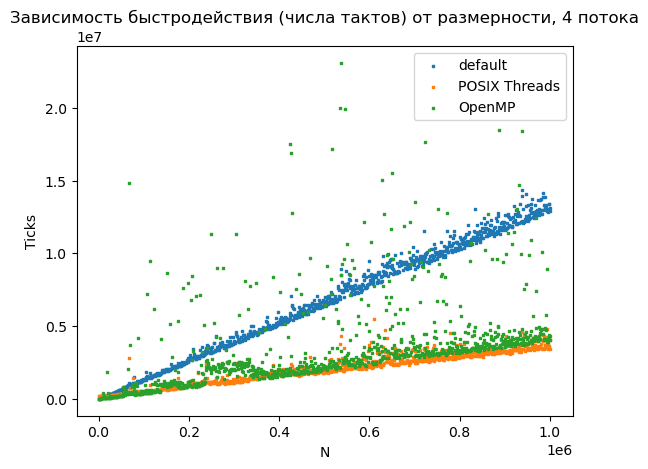
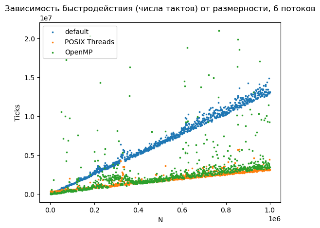
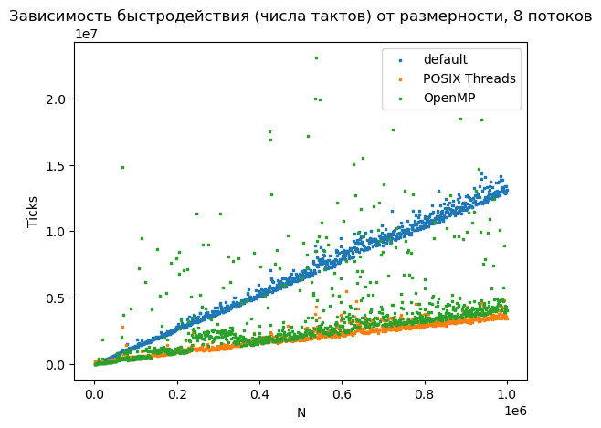
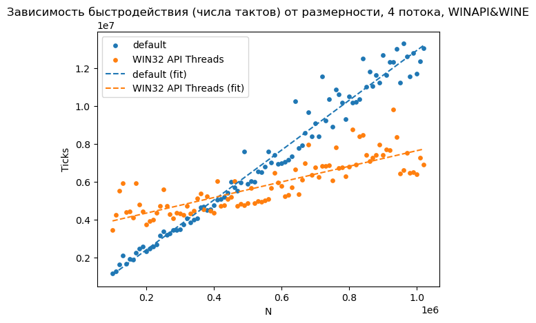

# «Параллельные вычислительные и программные модели для многопроцессорных вычислительных систем»

## Лабораторная работа №2 - Многопоточное программирование

### Вариант 14

В целочисленной последовательности найти количество элементов, попадающий в заданный диапазон.

**Цель работы**: изучение технологии многопоточного программирования и ее реализации в операционных системах UNIX и Windows.

В ходе работы требуется реализовать функции с использованием следующих технологий:
1. Без распараллеливания с использованием стандартных средств последовательного
программирования в качестве сравнительного эталона быстродействия и выдаваемого
результата.
1. С использованием API POSIX.
1. С использованием API Win32.
1. С использованием модификаторов OpenMP.

#### Вспомогательная структура
```c
// args_struct.h

#ifndef ARGS_H_INCLUDED
#define ARGS_H_INCLUDED

#include <stdio.h>
#include <stdlib.h>
#include <string.h>

#define max(a,b) ({ __typeof__ (a) _a = (a); __typeof__ (b) _b = (b); _a > _b ? _a : _b; })
#define min(a,b) ({ __typeof__ (a) _a = (a); __typeof__ (b) _b = (b); _a > _b ? _b : _a; })


typedef struct args {
    int* const array; 
    const size_t N;
    const int lbound;
    const int rbound;

    size_t result;
} args_t;

args_t create_args(int* const array, const size_t N, const int lbound, const int rbound);
void split_for_args(args_t *args, const size_t pool_size, args_t *argses, void *_args);

#endif
```

```c
// args_struct.c

#include "args_struct.h"

args_t create_args(int* const array, const size_t N, const int lbound, const int rbound){ 
    return (args_t){array, N, lbound, rbound, 0};
}

void split_for_args(args_t *args, const size_t dividing_size, args_t *argses, void *_args) {
    size_t _batch = args->N / dividing_size; // + (size_t) (((args_t*)_args)->N % 16);

    void *_helping_ptr;
    for (int i = 0; i <= dividing_size; ++i) {
        memcpy(argses + i, _args, sizeof(args_t));
        _helping_ptr = (size_t *)(&argses[i].array);
        *(int **)_helping_ptr = args->array + _batch * i;
        _helping_ptr = (size_t *)(&argses[i].N);
        *(size_t *)_helping_ptr = min(_batch, args->N - _batch * i);
    }
}

```

#### Стандартные средства

```c
// regular_sep.h

#ifndef REGULAR_SEP_H_INCLUDED
#define REGULAR_SEP_H_INCLUDED
#include <stddef.h>
#include <stdbool.h>
#include "args_struct.h"

size_t i32_count_in_range_sep(void* args, size_t div_size);

static void* process(void* args); 

static void counter_func(const int lbound, int *p, const int rbound, size_t *result);

static void count_processes_all(const size_t div_size, args_t *argses);

#endif
```

```c
// regular_sep.c

#include "regular_sep.h"

static size_t _counter = 0;

size_t i32_count_in_range_sep(void* _args, size_t div_size) {
    args_t* argses = (args_t*) malloc(sizeof(args_t) * (div_size + 1));
    args_t* args = (args_t*) _args;
    args->result = 0;
    _counter = 0;

    split_for_args(args, div_size, argses, _args);

    count_processes_all(div_size, argses);

    args->result = _counter;
    free(argses);

    return _counter;
}

static void count_processes_all(const size_t div_size, args_t *argses) {
    for (int i = 0; i <= div_size; ++i) {
        process(&argses[i]);
        _counter += argses[i].result;
    }

}

static void* process(void* _args) {
    args_t* args = (args_t*) _args;
    size_t* result = &(args->result);

    for (int* p = args->array; p < args->array + args->N; p++) {
        counter_func(args->lbound, p, args->rbound, result);
    }

    return NULL;
}

static void counter_func(const int lbound, int *p, const int rbound, size_t *result) {
    if ((lbound <= *p) && (*p < rbound)) {
        (*result)++;
    }
}

```

#### POSIX Threads & WIN32 API Threads

```c
// posix_threads.h

#ifndef POSIX_THREADS_H_INCLUDED
#define POSIX_THREADS_H_INCLUDED

#include <stddef.h>

#ifdef __linux__ 
#include <pthread.h>
#elif _WIN32

#endif

#include "args_struct.h"

static void *process(void *_args);
static void counter_func(const int lbound, int *p, const int rbound, size_t *result);
size_t i32_count_in_range_pthread(void*, const size_t);


#ifdef __linux__
void pthread_create_all(const size_t pool_size, pthread_t *pool, args_t *argses);
void pthread_join_all(const size_t pool_size, pthread_t *pool, args_t *argses);
#elif _WIN32
#include <windows.h>
size_t i32_count_in_range_pthread(void*, const size_t);
void wthread_create_all(const size_t pool_size, HANDLE *pool, args_t *argses);
void wthread_join_all(const size_t pool_size, HANDLE *pool, args_t *argses);
#endif

#endif
```

```c
// posix_threads.c

#include "posix_threads.h"
#include "bench.h"

static size_t _counter;

#ifdef __linux__
static pthread_mutex_t ptm_counter;
size_t i32_count_in_range_pthread(void* _args, const size_t pool_size) {

    // pthread_mutex_init(&ptm_counter, NULL);

    pthread_t* pool = (pthread_t*) malloc(sizeof(pthread_t) * (pool_size + 1));
    args_t* argses = (args_t*) malloc(sizeof(args_t) * (pool_size + 1));
    args_t* args = (args_t*) _args;
    args->result = 0;
    _counter = 0;


    split_for_args(args, pool_size, argses, _args);

    pthread_create_all(pool_size, pool, argses);
    pthread_join_all(pool_size, pool, argses);

    args->result = _counter;
    free(pool);
    free(argses);
    // pthread_mutex_destroy(&ptm_counter);

    return _counter;
}

void pthread_create_all(const size_t pool_size, pthread_t *pool, args_t *argses) {
    for (int i = 0; i <= pool_size; ++i) {
        pthread_create(pool + i, NULL, process, (void *)(argses + i));
    }
}

void pthread_join_all(const size_t pool_size, pthread_t *pool, args_t *argses) {
    for (int i = 0; i <= pool_size; ++i) {
        pthread_join(pool[i], NULL);
        _counter += argses[i].result;
    }
}

#elif _WIN32

size_t i32_count_in_range_pthread(void* _args, const size_t pool_size) {

    // pthread_mutex_init(&ptm_counter, NULL);

    HANDLE* pool = (HANDLE*) malloc(sizeof(HANDLE) * (pool_size + 1));
    args_t* argses = (args_t*) malloc(sizeof(args_t) * (pool_size + 1));
    args_t* args = (args_t*) _args;
    args->result = 0;
    _counter = 0;


    split_for_args(args, pool_size, argses, _args);

    wthread_create_all(pool_size, pool, argses);
    wthread_join_all(pool_size, pool, argses);

    args->result = _counter;
    free(pool);
    free(argses);
    // pthread_mutex_destroy(&ptm_counter);

    return _counter;
}


static DWORD WINAPI win_process(LPVOID _args) {
    args_t* args = (args_t*) _args;
    size_t* result = &(args->result);
    if (args->N < 0) {
        return 0;
    }
    for (int* p = args->array; p < args->array + args->N; p++) {
        counter_func(args->lbound, p, args->rbound, result);
    }

    ExitThread(0);
}
    
void wthread_create_all(const size_t pool_size, HANDLE *pool, args_t* argses) {
    for (int i = 0; i <= pool_size; ++i) {
        *(pool + i) = CreateThread(NULL, 0, win_process, (LPVOID) &argses[i], 0, NULL);

        //pthread_create(pool + i, NULL, process, (void *)(argses + i));
    }
}

void wthread_join_all(const size_t pool_size, HANDLE *pool, args_t* argses) {
    WaitForMultipleObjects(pool_size, pool, TRUE, INFINITE);
    for (int i = 0; i <= pool_size; ++i) {
        CloseHandle(pool[i]);
        _counter += argses[i].result;
    }
}


#endif

static void* process(void* _args) {
    args_t* args = (args_t*) _args;
    size_t* result = &(args->result);
    if (args->N < 0) {
        return NULL;
    }
    for (int* p = args->array; p < args->array + args->N; p++) {
        counter_func(args->lbound, p, args->rbound, result);
    }

    // pthread_mutex_lock(&ptm_counter);
    // _counter += *result;
    // pthread_mutex_unlock(&ptm_counter);

    return NULL;
}

static void counter_func(const int lbound, int *p, const int rbound, size_t *result) {
    if ((lbound <= *p) && (*p < rbound)) {
        (*result)++;
    }
}
```


#### OpenMP

```c
// omps.h

#ifndef OMPS_H_INCLUDED
#define OMPS_H_INCLUDED

#include <stdio.h>
#include <stdlib.h>
#include "args_struct.h"
#include <omp.h>

size_t i32_count_in_range_omp(void* _args, size_t div_size);
static void* process(void* _args);
static void counter_func(const int lbound, int *p, const int rbound, size_t *result);

#endif
```

```c
#include "omps.h"

static size_t _counter = 0;

size_t i32_count_in_range_omp(void* _args, size_t div_size) {
    args_t* argses = (args_t*) malloc(sizeof(args_t) * (div_size + 1));
    args_t* args = (args_t*) _args;
    args->result = 0;

    size_t count = 0;

    split_for_args(args, div_size, argses, _args);

    #pragma omp parallel for reduction(+:count)
    for (int i = 0; i <= div_size; ++i) {
        process(&argses[i]);
        count += argses[i].result;
    }

    args->result = count;

    free(argses);
    return count;
}

static void* process(void* _args) {
    args_t* args = (args_t*) _args;
    size_t* result = &(args->result);

    for (int* p = args->array; p < args->array + args->N; p++) {
        counter_func(args->lbound, p, args->rbound, result);
    }

    return NULL;
}

static void counter_func(const int lbound, int *p, const int rbound, size_t *result) {
    if ((lbound <= *p) && (*p < rbound)) {
        (*result)++;
    }
}
```

#### Измерение времени
```c
// bench.h

#ifndef BENCH_H_INCLUDED
#define BENCH_H_INCLUDED

#include <stdint.h>
#include <string.h>
#include <cpuid.h>
#include <immintrin.h>
#include <x86intrin.h>


#if defined(__i386__)
unsigned long long rdtsc(void);size_t i32_count_in_range_sep(void* _args, size_t div_size) 

#elif defined(__x86_64__)   
unsigned long long rdtsc(void);
#endif

typedef size_t (*func_t)(void*, size_t);

uint64_t tickbegin();
uint64_t tickend();

uint64_t tick_benchmark(func_t, void*, size_t);

#endif
```

```c
// bench.c

#include "bench.h"

#pragma GCC target("avx2")
#pragma intrinsic(__rtdsc)

#if defined(__i386__)

unsigned long long rdtsc(void) {
    unsigned long long int x;
    __asm__ volatile (".byte 0x0f, 0x31" : "=A" (x));
    return x;
}

#elif defined(__x86_64__)

unsigned long long rdtsc(void) {
    unsigned hi, lo;
    __asm__ __volatile__ ("rdtsc" : "=a"(lo), "=d"(hi));
    return ( (unsigned long long)lo)|( ((unsigned long long)hi)<<32 );
}

#endif

uint64_t tickbegin() {
    int dummy[4];
    __cpuid(0, dummy[0], dummy[1], dummy[2], dummy[3]);// Prevent the compiler from optimizing away the whole Serialize function:
    volatile int DontSkip = dummy[0];
    return rdtsc();
}

uint64_t tickend() {
    int dummy[4];
    int eax, ebx, ecx, edx;
    uint64_t r = rdtsc();
    __cpuid(0, dummy[0], dummy[1], dummy[2], dummy[3]);// Prevent the compiler from optimizing away the whole Serialize function:
    volatile int DontSkip = dummy[0];
    return r;
}

uint64_t tick_benchmark(func_t bench_func, void* _args, size_t div_size) {
    uint64_t tb, te, ticks, tb1, te1 = 0UL, tb2, te2 = 0UL;
    
    tb = tickbegin();
    size_t N = 100UL;
    for (size_t i=0; i<N; ++i ){
        tb1 = tickbegin();
        // te1 += tickend() - tb1;
        volatile int s = bench_func(_args, div_size);
        tb2 = tickbegin();
        // te2 += tickend() - tb2;
    }
    te = tickend();
    ticks = ((te - tb) - (te1 + te2))/N;
    return ticks;
}
```

#### Точка входа

```c
// main.c

#include <stdio.h>
#include <stdlib.h>
#include <stdbool.h>
#include <time.h>
#include <string.h>

#include "bench.h"
#include "regular.h"
#include "regular_sep.h"
#include "posix_threads.h"
#include "omps.h"

const size_t RMAX = 32;
int* const generate_sequence(int* const, const size_t);
void print_sequence(int* const, const size_t);

int main(int argc, char* argv[]) {
    srand(time(NULL));


    uint64_t NUM;
    size_t N;
    int a, b;

    scanf("%lu %lu %d %d", &NUM, &N, &a, &b);
    int* const _arr = (int* const) malloc(N * sizeof(int));
    generate_sequence(_arr, N);

    args_t args = {_arr, N, a, b, 0};

    printf("%lu, %lu, ", NUM, N);


    printf("%lu, ", tick_benchmark(i32_count_in_range_sep, (void*) &args, NUM));
    printf("%lu, ", tick_benchmark(i32_count_in_range_pthread, (void*)&args, NUM));
    printf("%lu;\n", tick_benchmark(i32_count_in_range_omp, (void*)&args, NUM));
    
    free(_arr);
    return 0;
}


void print_sequence(int* const array, const size_t N) {
    for (size_t i = 0; i<N; ++i) {
        printf("%d ", array[i]);
    }
    printf("\n");
}

int* const generate_sequence(int* const array, const size_t N){
    for (size_t i = 0; i<N; ++i) {
        array[i] = rand() % RMAX;
    }
    return array;
}
```

#### Сборка
- Linux
```Makefile
TARGET = lab2
CC = gcc
CFLAGS = -mavx -pthread -fopenmp -O1

SRC_DIR = ./src/
OBJ_DIR = ./obj/


SRC = $(wildcard $(SRC_DIR)*.c)
OBJ = $(patsubst $(SRC_DIR)%.c, $(OBJ_DIR)%.o, $(SRC))

$(TARGET): $(OBJ)
	$(CC) $(CFLAGS) $(OBJ) -o $(TARGET)

$(OBJ_DIR)%.o : $(SRC_DIR)%.c 
	$(CC) $(CFLAGS) -c $< -o $@ 


clean:
	rm $(TARGET) $(OBJ_DIR)*.o

```

- Windows

```Makefile
TARGET = lab2_win.exe
CC = x86_64-w64-mingw32-gcc
CFLAGS = -mavx -O1 -mwindows 

SRC_DIR = ./src/
OBJ_DIR = ./obj/


SRC = $(wildcard $(SRC_DIR)*.c)
OBJ = $(patsubst $(SRC_DIR)%.c, $(OBJ_DIR)%.o, $(SRC))

$(TARGET): $(OBJ)
	$(CC) $(CFLAGS) $(OBJ) -o $(TARGET)

$(OBJ_DIR)%.o : $(SRC_DIR)%.c 
	$(CC) $(CFLAGS) -c $< -o $@ 


clean:
	rm $(TARGET) $(OBJ_DIR)*.o

```

#### Исследование зависимости числа тактов от размера последовательности








